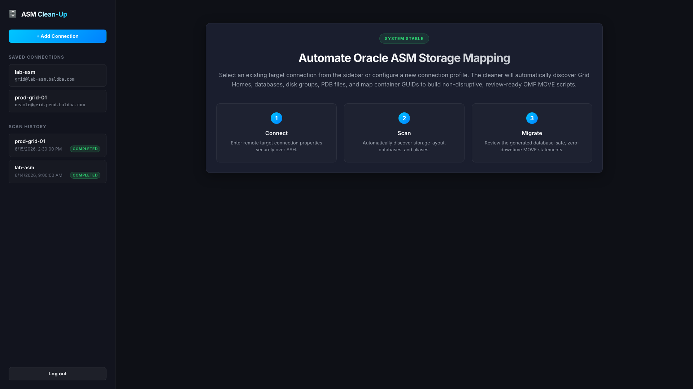
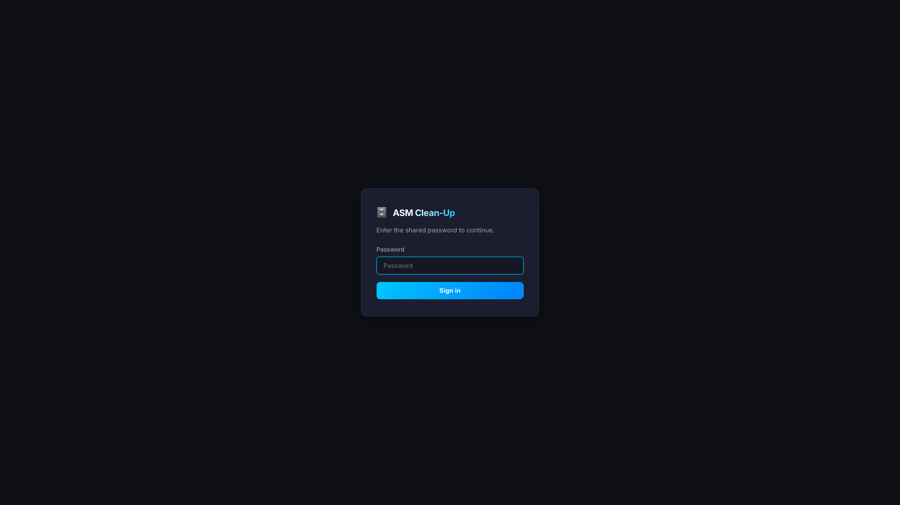
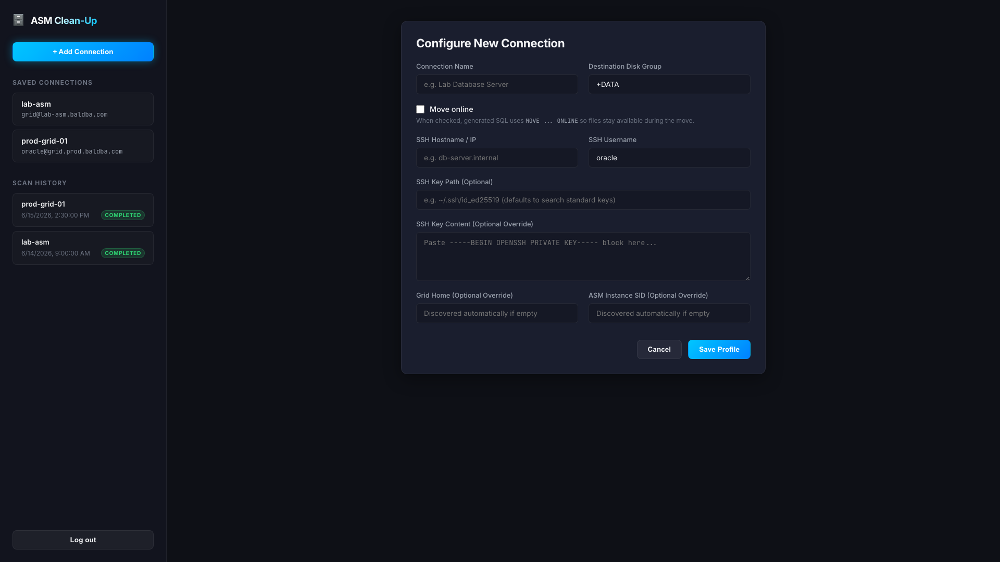
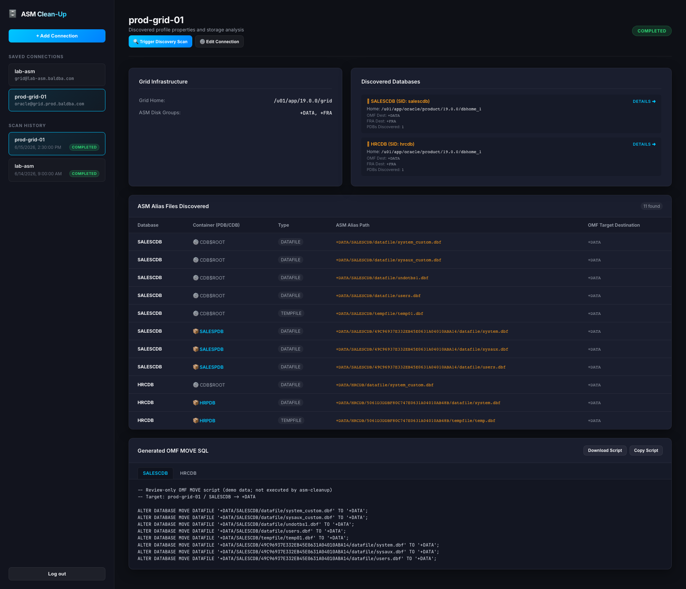
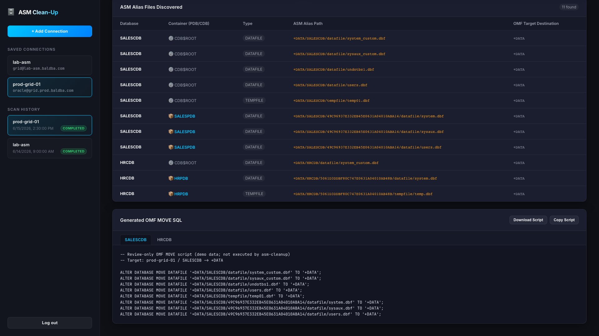

# asm-cleanup

Walk Oracle ASM, inventory DATAFILE/TEMPFILE aliases, and emit review-only OMF **MOVE** SQL. The **primary interface is the web GUI**: connect over SSH, run discovery scans, review alias inventory, and download generated SQL — without writing YAML or calling the library API.

Supports local `asmcmd` or SSH (Fabric) with Grid env wrapping. Does **not** connect via SQL\*Net or execute moves — generated SQL is a review artifact only.

## Why this exists (Context)

When converting non-container databases (non-CDB) to container databases (CDB), you can end up with a large number of aliased files in ASM. This becomes increasingly difficult to manage when the files are not stored in a single `+DATA/{DBNAME}` directory, but are instead spread across multiple directories due to legacy upgrades and database name changes.

`asm-cleanup` was built to consolidate all these scattered datafiles into a single directory. It scans ASM disk groups, inventories the existing aliases, and generates the required Oracle Managed Files (OMF) `MOVE` SQL statements to relocate files cleanly into the target directory structure.



## Requirements

- Python 3.13+
- `asmcmd` on the target (PATH locally, or under Grid home remotely)
- For SSH: Fabric `connect_kwargs` (e.g. `key_filename`); if omitted, `~/.ssh/id_ed25519` or `id_rsa` is discovered when present
- Target connection profiles stored in SQLite (managed in the web UI)

## Quick start (web GUI)

```bash
cd /path/to/asm-cleanup
uv sync --extra web --group dev
./scripts/setup_env.sh   # generates password, JWT secret, and keyring key
uv run asm-cleanup web
```

Open **http://127.0.0.1:8000**, sign in with the shared password, add a connection, and trigger a discovery scan from the UI.

| Env var | Required | Purpose |
|---------|----------|---------|
| `ASM_CLEANUP_PASSWORD` | yes (web) | Shared login password (not a placeholder; min 8 characters) |
| `ASM_CLEANUP_JWT_SECRET` | yes (web) | HS256 signing secret (≥32 bytes; not a `change-me` placeholder) |
| `ASM_CLEANUP_KEYRING_KEY` | yes (web/run) | Passphrase for the SSH-key cryptfile (≥32 bytes) |
| `ASM_CLEANUP_KEYRING_FILE` | no | Cryptfile path (default: next to the SQLite database) |
| `ASM_CLEANUP_JWT_TTL_SECONDS` | no | Token lifetime (default `86400`) |
| `ASM_CLEANUP_TIMEZONE` | no | Timezone for generated files and database records (default `UTC`, e.g., `America/Detroit`) |

### Docker

```bash
./scripts/setup_env.sh   # generates password, JWT secret, and keyring key
docker compose up --build
```

The web service persists targets and scans in a SQLite volume at `/data/asm_cleanup.db`. Pasted SSH private keys are stored in an encrypted cryptfile (`/data/ssh_keys.cryptfile.cfg`) unlocked by `ASM_CLEANUP_KEYRING_KEY`, not in SQLite.

For documentation screenshots, use the separate `web-demo` service on port **8001**. It loads the committed fictional database at [`docs/demo/asm_cleanup_demo.db`](docs/demo/asm_cleanup_demo.db) and never shares a volume with `web`.

```bash
docker compose up --build web-demo
# open http://127.0.0.1:8001
```

### Documentation screenshots

Regenerate the README PNGs (1920×1080) against `web-demo`:

```bash
./scripts/generate_screenshots.sh
```

That script syncs deps, installs Playwright Chromium, starts `web-demo`, captures the five images into `docs/images/`, then stops `web-demo`. It reads `ASM_CLEANUP_PASSWORD` from `.env` (same file Docker Compose uses) and never touches the real `web` / `asm_cleanup.db` volume.

Manual equivalent:

```bash
docker compose up --build web-demo
uv sync --extra web --group docs
uv run --group docs playwright install chromium
uv run --group docs python scripts/capture_docs_screenshots.py --base-url http://127.0.0.1:8001
```

After schema migrations, rebuild the committed demo DB (does not touch your real `asm_cleanup.db`):

```bash
uv run --extra web asm-cleanup db build-demo
# or: uv run --extra web python scripts/build_demo_db.py
```

---

## Using the web GUI

### 1. Sign in

The dashboard uses a single shared password (no usernames). Sign in at the login screen, then manage connections and scans from the sidebar.



### 2. Add a connection

Click **+ Add Connection** and enter SSH details for the Grid/Oracle host. Grid home and ASM SID are optional — discovery fills them in when omitted. Destination disk group defaults to `+DATA` and drives MOVE SQL targets.



| Field | Required | Notes |
|-------|----------|-------|
| Connection Name | yes | Unique profile name (also used by CLI `run`) |
| Destination Disk Group | yes | Target disk group for MOVE commands (default `+DATA`) |
| SSH Hostname / IP | yes | Remote host |
| SSH Username | yes | Typically `oracle` or `grid` |
| SSH Key Path / Content | no | Path on the app host, or a pasted private key stored in the encrypted cryptfile (`ASM_CLEANUP_KEYRING_KEY`); standard keys auto-discovered when omitted |
| Grid Home / ASM SID | no | Overrides; auto-discovered when empty |

### 3. Run a discovery scan

Select a saved connection and click **Trigger Discovery Scan**. The runner discovers disk groups, databases, PDB GUID maps, and walk scope over SSH, then walks ASM aliases and emits review SQL. Progress and history appear in the sidebar.

### 4. Review results and SQL

Completed scans show Grid metadata, discovered databases, the alias inventory table, and generated OMF MOVE SQL. Use **Download Script** or **Copy Script** to take the SQL offline for review — nothing is executed against the database.





---

## CLI and library (secondary)

CLI and Python APIs are available for automation and scripting. Day-to-day use should go through the web GUI above.

### Subcommands

| Command | Purpose |
|---------|---------|
| `web` | Start the FastAPI web dashboard (primary) |
| `run TARGET` | Run a synchronous discovery scan on a saved target |
| `db upgrade` | Run Alembic database migrations |
| `db build-demo` | Rebuild `docs/demo/asm_cleanup_demo.db` (docs only) |

```bash
uv run asm-cleanup --help
uv run asm-cleanup run my-target-name
```

`POST /api/auth/login` with `{ "password": "..." }` returns a bearer token; other `/api/*` routes require `Authorization: Bearer <token>`. Library / `run` / `db` CLI paths are not JWT-gated.

### Optional web dependencies

Core library install is fabric + loguru + pydantic. Web UI, REST API, SQLite persistence, and CLI `web` / `run` / `db` need:

```bash
uv sync --extra web
```

### Library API

When using the library pipeline directly, pass `ScopeConfig`, `MovePolicy`, and `ConnectionConfig`:

```python
from asm_cleanup import (
    AsmSession,
    ConnectionConfig,
    ConnectionMode,
    MovePolicy,
    ScopeConfig,
)

connection = ConnectionConfig(
    mode=ConnectionMode.ssh,
    host="grid-lab.example.com",
    user="oracle",
    grid_home="/u01/app/19c/grid",
    oracle_sid="+ASM",
    connect_kwargs={"key_filename": "/home/you/.ssh/id_ed25519"},
)
scope = ScopeConfig(
    disk_groups=["+DATA", "+FRA"],
    databases=["MYDB"],
)
move_policy = MovePolicy(destination_disk_group="+DATA")

with AsmSession.open(connection, scope=scope, move_policy=move_policy) as session:
    results = session.run()  # expands scope.disk_groups × scope.databases
```

Omit `asm_path` to expand `scope.disk_groups × scope.databases` (or only `scope.default_asm_path` when set). Pass an explicit path for a single subtree.

```python
from asm_cleanup import AsmSession, ConnectionConfig, MovePolicy, ScopeConfig

with AsmSession.open(connection, scope=scope, move_policy=move_policy) as session:
    inventory = session.walk("+DATA/MYDB")
    aliases = inventory.extract_aliases()
    sql = session.emit_sql(inventory)
    results = session.run()  # full pipeline; writes transcript / .sql / .json
```

Start from [`config.example.yaml`](config.example.yaml) for library-only config shapes. CLI/web targets live in SQLite (not YAML).

### PDB GUID map and SQL emit

Multitenant ASM paths often use `+DG/DB/<32-hex-GUID>/DATAFILE|TEMPFILE/`.

**Web/CLI discovery scans:** collect GUID maps during host discovery, inject `PDB_GUID_<prefix>` placeholders for any remaining unmapped GUIDs, and emit with `fail_on_unmapped=False` so a scan can still produce review SQL.

**Library API:** set `move_policy.auto_pdb_guid_map: true` (default) to fetch via srvctl + sqlplus before emit, or provide a manual `pdb_guid_map`. **Unmapped GUIDs fail emit** (`UnmappedPdbGuidError`) — inventory still succeeds.

### ASMCMD-8102 over SSH

Non-interactive SSH often needs Grid env setup. Set on `ConnectionConfig`:

```python
ConnectionConfig(
    mode=ConnectionMode.ssh,
    host="grid.example.com",
    user="oracle",
    grid_home="/u01/app/grid",
    oracle_sid="+ASM",
    use_oraenv=True,
    oraenv_path="/usr/local/bin/oraenv",
)
```

Or set `oracle_sid` alone (simple `ORACLE_HOME`/`PATH` exports), or a full custom `asm_env_init` preamble. Failed `asmcmd` calls raise `AsmCmdError` (including ASMCMD-8102 hints) instead of returning empty listings.

### Debug

- Env: `ASM_CLEANUP_DEBUG=1` (or `true` / `yes` / `on`)
- Library: `AsmSession.open(connection, scope=..., move_policy=..., debug=True)`

Uses **loguru** (no library `print` paths aside from the CLI human report).

---

## Example outputs

Artifacts land under `logs/` by default (library pipeline). Web scans also persist inventory and SQL on the scan record for download from the UI.

| Artifact | Pattern | Contents |
|----------|---------|----------|
| Walk transcript | `asm_walk_YYYYMMDD_….txt` | Versioned listing (`# asm-cleanup-transcript:1`) |
| OMF MOVE SQL | `asm_omf_fix_YYYYMMDD_….sql` | Draft `ALTER DATABASE MOVE …` statements |
| Result JSON | `asm_result_YYYYMMDD_….json` | Machine-readable `WalkResult` |

Multi-path walks add a sequence segment (`_00_`, `_01_`, …) to the filename slug.

### Generated MOVE SQL (CDB$ROOT)

```sql
-- =========================================================
-- FIX DATAFILE
-- Source: +DATA/MYDB/DATAFILE/system.dbf
-- Target: +DATA/MYDB/DATAFILE/SYSTEM.255.1
-- =========================================================
ALTER DATABASE MOVE DATAFILE '+DATA/MYDB/DATAFILE/system.dbf' TO '+DATA';
```

For PDB-scoped aliases (GUID directory in the path), the emitter inserts container switches when the GUID is mapped:

```sql
-- Switch to container TOOLKITPDB so following MOVE statements run in that PDB (or CDB$ROOT).
ALTER SESSION SET CONTAINER = TOOLKITPDB;

-- =========================================================
-- FIX DATAFILE
-- Source: +DATA/MYDB/49C96937E332EB45E0631A04010ABA14/DATAFILE/a.dbf
-- Target: +DATA/OMF
-- =========================================================
ALTER DATABASE MOVE DATAFILE '+DATA/MYDB/49C96937E332EB45E0631A04010ABA14/DATAFILE/a.dbf' TO '+DATA';
```

---

## Package layout

```
asm_cleanup/
  cli.py
  web/          # FastAPI app, routers, auth deps
  static/       # Web UI assets
  config/       # ConnectionConfig, ScopeConfig, MovePolicy
  transport/    # AsmCmdPort, LocalShellAdapter, SshGridAdapter
  walk/         # AsmWalker, AsmInventory, transcript I/O
  domain/       # AliasRecord, path helpers
  sql/          # MoveSqlEmitter (fail-fast unmapped GUIDs)
  pipeline/     # AsmSession, PipelineOrchestrator, WalkScopeResolver
  services/     # ConnectionFactory, ScanService, AliasEnricher, TargetMapper
  report/       # human + JSON reporters
  discovery/    # HostDiscovery, TargetDiscoveryRunner facade
  db/           # SQLite models + Alembic helpers
```

CLI/web scans (`TargetDiscoveryRunner` → `ScanService`) discover Grid/DB facts over SSH, then reuse
`PipelineOrchestrator` / `AsmWalker` for walk + SQL. Dictionary remapping and non-OMF
file enrichment stay in `AliasEnricher` before persistence.

## Testing

```bash
uv run pytest
```

Unit tests use `FakeAsmCmdPort` and inline transcript fixtures. No live SSH/asmcmd in CI.
